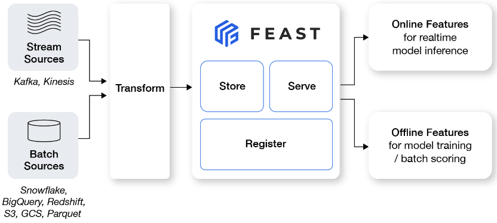

## &nbsp; Workshop: Learning Feast 

This workshop aims to teach users about [Feast](http://feast.dev), an open-source feature store. 

We explain concepts & best practices by example, and also showcase how to address common use cases.

### What is Feast?
Feast is an operational system for managing and serving machine learning features to models in production. It can serve features from a low-latency online store (for real-time prediction) or from an offline store (for  batch scoring). 

### Why Feast?
Feast solves several common challenges teams face:
1. Lack of feature reuse across teams
2. Training-serving skew and complex point-in-time-correct data joins
3. Difficulty operationalizing features for online inference

### Pre-requisites
This workshop assumes you have the following installed:
- A local development environment that supports running Jupyter notebooks (e.g. VSCode with Jupyter plugin)
- Python 3.7+
- pip
- Docker & Docker Compose (e.g. `brew install docker docker-compose`)
- Terraform ([docs](https://learn.hashicorp.com/tutorials/terraform/install-cli#install-terraform))
- An AWS account setup with credentials(e.g see [AWS credentials quickstart](https://docs.aws.amazon.com/cli/latest/userguide/cli-configure-quickstart.html#cli-configure-quickstart-creds))

Since we'll be learning how to leverage Feast in CI/CD, you'll also need to fork this workshop repository.

**Caveats** 
- M1 Macbook development is untested with this flow. See also [How to run / develop for Feast on M1 Macs](https://github.com/feast-dev/feast/issues/2105).
- Windows development is untested with this flow.

## Modules
*See also: [Feast quickstart](https://docs.feast.dev/getting-started/quickstart), [Feast x Great Expectations tutorial](https://docs.feast.dev/tutorials/validating-historical-features)*

These are meant mostly to be done in order, with examples building on previous concepts.

| Time (min) | Description                                                             | Module&nbsp;&nbsp;&nbsp;       |
| :--------: | :---------------------------------------------------------------------- | :----------------------------- |
|   30-45    | Setting up Feast projects & CI/CD + powering batch predictions          | [Module 0](module_0/README.md) |
|   15-20    | Streaming ingestion & online feature retrieval with Kafka, Spark, Redis | [Module 1](module_1/README.md) |
|   10-15    | Real-time feature engineering with on demand transformations            | [Module 2](module_2/README.md) |
|    TBD     | Feature server deployment (embed, as a service, AWS Lambda)             | TBD                            |
|    TBD     | Versioning features / models in Feast                                   | TBD                            |
|    TBD     | Data quality monitoring in Feast                                        | TBD                            |
|    TBD     | Batch transformations                                                   | TBD                            |
|    TBD     | Stream transformations                                                  | TBD                            |