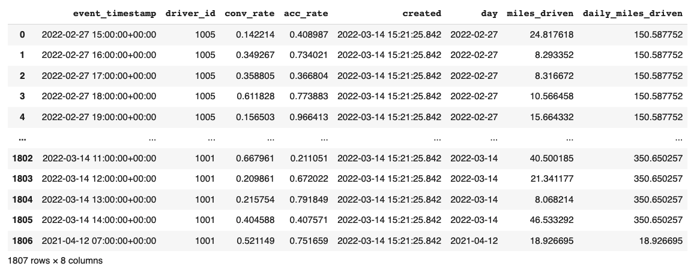
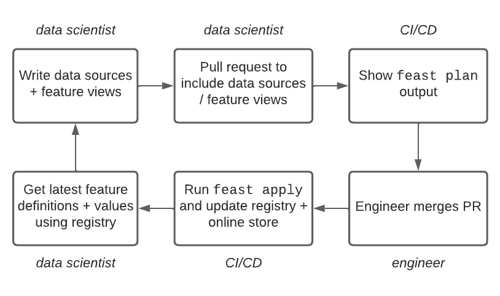
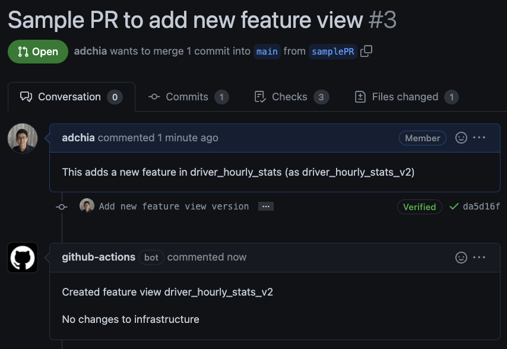

<h1>Module 0: Setting up a feature repo, sharing features, batch predictions</h1>

Welcome! Here we use a basic example to explain key concepts and user flows in Feast. 

We focus on a specific example (that does not include online features or realtime models):
- **Goal**: build a platform for data scientists and engineers to share features for training offline models
- **Use case**: Predicting churn for drivers in a ride-sharing application.
- **Stack**: you have data in a combination of data warehouses (to be explored in a future module) and data lakes (e.g. S3)
  
<h2>Table of Contents</h2>

- [Installing Feast](#installing-feast)
- [Exploring the data](#exploring-the-data)
- [Reviewing Feast concepts](#reviewing-feast-concepts)
  - [A quick primer on feature views](#a-quick-primer-on-feature-views)
- [User groups](#user-groups)
  - [User group 1: ML Platform Team](#user-group-1-ml-platform-team)
    - [Step 0: Setup S3 bucket for registry and file sources](#step-0-setup-s3-bucket-for-registry-and-file-sources)
    - [Step 1: Setup the feature repo](#step-1-setup-the-feature-repo)
      - [Step 1a: Use your configured S3 bucket](#step-1a-use-your-configured-s3-bucket)
      - [Some further notes and gotchas](#some-further-notes-and-gotchas)
      - [Step 1b: Run `feast plan`](#step-1b-run-feast-plan)
      - [Step 1c: Run `feast apply`](#step-1c-run-feast-apply)
      - [Step 1d: Verify features are registered](#step-1d-verify-features-are-registered)
    - [Step 2: Setup a Web UI endpoint](#step-2-setup-a-web-ui-endpoint)
    - [Step 3: Adding the feature repo to version control & set up CI/CD](#step-3-adding-the-feature-repo-to-version-control--set-up-cicd)
      - [Step 3a: Automatically run `feast plan` for new pull requests](#step-3a-automatically-run-feast-plan-for-new-pull-requests)
      - [Step 3b: Automatically run `feast apply` when pull requests are merged](#step-3b-automatically-run-feast-apply-when-pull-requests-are-merged)
      - [Step 3c (optional): Access control for the registry](#step-3c-optional-access-control-for-the-registry)
    - [Other best practices](#other-best-practices)
  - [User group 2: ML Engineers](#user-group-2-ml-engineers)
    - [Step 0: Understanding `get_historical_features` and feature services](#step-0-understanding-get_historical_features-and-feature-services)
    - [Step 1: Fetch features for batch scoring (method 1)](#step-1-fetch-features-for-batch-scoring-method-1)
    - [Step 2: Fetch features for batch scoring (method 2)](#step-2-fetch-features-for-batch-scoring-method-2)
    - [Step 3 (optional): Scaling `get_historical_features` to large datasets](#step-3-optional-scaling-get_historical_features-to-large-datasets)
  - [User group 3: Data Scientists](#user-group-3-data-scientists)
- [Exercise: merge a sample PR in your fork](#exercise-merge-a-sample-pr-in-your-fork)
- [Conclusion](#conclusion)
- [FAQ](#faq)
    - [How do I generate the entity dataframe?](#how-do-i-generate-the-entity-dataframe)
    - [Can I call `get_historical_features` without an entity dataframe? I want features for all entities.](#can-i-call-get_historical_features-without-an-entity-dataframe-i-want-features-for-all-entities)

# Installing Feast
Before we get started, first install Feast with AWS dependencies:

```bash
pip install "feast[aws]"
```

# Exploring the data
We've made some dummy data for this workshop in `infra/driver_stats.parquet`. Let's dive into what the data looks like. You can follow along in [explore_data.ipynb](explore_data.ipynb):

```python
import pandas as pd
pd.read_parquet("infra/driver_stats.parquet")
```



This is a set of time-series data with `driver_id` as the primary key (representing the driver entity) and `event_timestamp` as showing when the event happened. 

# Reviewing Feast concepts
Let's quickly review some Feast concepts needed to build this ML platform / use case. Don't worry about committing all this to heart. We explore these concepts by example throughout the workshop.
| Concept&nbsp;&nbsp;&nbsp;&nbsp;&nbsp;&nbsp;&nbsp;&nbsp;&nbsp;&nbsp;&nbsp;&nbsp; | Description                                                                                                                                                                                                                                                                                                                                                                                               |
| :------------------------------------------------------------------------------ | :-------------------------------------------------------------------------------------------------------------------------------------------------------------------------------------------------------------------------------------------------------------------------------------------------------------------------------------------------------------------------------------------------------- |
| Data source                                                                     | We need a `FileSource` (with an S3 path and endpoint override) to represent the `driver_stats.parquet` which will be hosted in S3. Data sources can generally be files or tables in data warehouses.                                                                                                                                                                                                      |
| Entity                                                                          | The main entity we need here is a driver entity (with `driver_id` as the join key)                                                                                                                                                                                                                                                                                                                        |
| Feature view                                                                    | We'll have various feature views corresponding to different logical groups of features and transformations from data sources keyed on entities. These can be shared / re-used by data scientists and engineers and are registered with `feast apply`. <br><br/> Feast also supports reusable last mile transformations with `OnDemandFeatureView`s. We explore this  in [Module 2](../module_2/README.md) |
| Feature service                                                                 | We build different model versions with different sets of features using feature services (`model_v1`, `model_v2`). Feature services group features a given model version depends on. It allows retrieving all necessary model features by using a feature service name.                                                                                                                                   |
| Registry                                                                        | Where Feast tracks registered features, data sources, entities, feature services and metadata. Users + model servers will pull from this to discover registered features.                                                                                                                                                                                                                                 |
| Provider                                                                        | We use the AWS provider here. A provider is a customizable interface that Feast uses to orchestrate feature generation / retrieval. <br></br>Specifying a built-in provider (e.g. `aws`) ensures your registry can be stored in S3 (and also specifies default offline / online stores)                                                                                                                   |
| Offline store                                                                   | What Feast will use to execute point in time joins (typically a data warehouse). Here we use `file`                                                                                                                                                                                                                                                                                                       |
| Online store                                                                    | Low-latency data store that Feast uses to power online inference. Feast ingests offline feature values and streaming features into the online store. In this module, we do not need one.                                                                                                                                                                                                                  |
## A quick primer on feature views
Let's look at a feature view we have in this module:
```python
driver_hourly_stats_view = FeatureView(
    name="driver_hourly_stats",
    description="Hourly features",
    entities=["driver"],
    ttl=timedelta(seconds=8640000000),
    schema=[
        Field(name="conv_rate", dtype=Float32),
        Field(name="acc_rate", dtype=Float32),
    ],
    online=True,
    source=driver_stats,
    tags={"production": "True"},
    owner="test2@gmail.com",
)
```

Feature views are one of the most important concepts in Feast.

They represent a group of features that should be physically colocated (e.g. in the offline or online stores). More specifically:
- The above feature view comes from a single batch source (a `FileSource`). 
- If we wanted to also use an online store, the above feature view would be colocated in e.g. a Redis hash or a DynamoDB table. 
- A common need is to have both a batch and stream source for a single set of features. You'd thus have a `FeatureView` that essentially can have two different sources but map to the same physical location in the online store.

It's worth noting that there are multiple types of feature views. `OnDemandFeatureView`s for example enable row-level transformations on data sources and request data, with the output features described in the `schema` parameter.

# User groups
There are three user groups here worth considering. The ML platform team, the ML engineers running batch inference on models, and the data scientists building models. 

## User group 1: ML Platform Team
The team here sets up the centralized Feast feature repository and CI/CD in GitHub. This is what's seen in `feature_repo_aws/`.

### Step 0: Setup S3 bucket for registry and file sources
This assumes you have an AWS account & Terraform setup. If you don't:
- Set up an AWS account, install the AWS CLI, and setup your credentials with `aws configure` as per the [AWS credential quickstart](https://docs.aws.amazon.com/cli/latest/userguide/cli-configure-quickstart.html#cli-configure-quickstart-creds)
- Install [Terraform](https://learn.hashicorp.com/tutorials/terraform/install-cli#install-terraform)

We've made a simple Terraform project to help with S3 bucket creation (and uploading the test data we need):
```bash
cd infra/
terraform init
terraform apply
```

Output:
```bash
aws_s3_bucket.feast_bucket: Creating...
aws_s3_bucket.feast_bucket: Creation complete after 3s [id=feast-workshop-danny]
aws_s3_bucket_acl.feast_bucket_acl: Creating...
aws_s3_object.driver_stats_upload: Creating...
aws_s3_bucket_acl.feast_bucket_acl: Creation complete after 0s [id=feast-workshop-danny,private]
aws_s3_object.driver_stats_upload: Creation complete after 1s [id=driver_stats.parquet]

Apply complete! Resources: 3 added, 0 changed, 0 destroyed.

Outputs:

project_bucket = "s3://feast-workshop-danny"
project_name = "danny"
```

### Step 1: Setup the feature repo
The first thing a platform team needs to do is setup a `feature_store.yaml` file within a version controlled repo like GitHub. `feature_store.yaml` is the primary way to configure an overall Feast project. We've setup a sample feature repository in `feature_repo_aws/`

#### Step 1a: Use your configured S3 bucket
There are two files in `feature_repo_aws` you need to change to point to your S3 bucket:

**data_sources.py**
```python
driver_stats = FileSource(
    name="driver_stats_source",
    path="s3://[INSERT YOUR BUCKET]/driver_stats.parquet",
    s3_endpoint_override="http://s3.us-west-2.amazonaws.com",  # Needed since s3fs defaults to us-east-1
    timestamp_field="event_timestamp",
    created_timestamp_column="created",
    description="A table describing the stats of a driver based on hourly logs",
    owner="test2@gmail.com",
)
```

**feature_store.yaml**
```yaml
project: feast_demo_aws
provider: aws
registry: s3://[INSERT YOUR BUCKET]/registry.pb
online_store: null
offline_store:
  type: file
flags:
  alpha_features: true
  on_demand_transforms: true
```

A quick explanation of what's happening in this `feature_store.yaml`:

| Key             | What it does                                                                         | Example                                                                                                  |
| :-------------- | :----------------------------------------------------------------------------------- | :------------------------------------------------------------------------------------------------------- |
| `project`       | Gives infrastructure isolation via namespacing (e.g. online stores + Feast objects). | any unique name within your organization (e.g. `feast_demo_aws`)                                         |
| `provider`      | Defines registry location & sets defaults for offline / online stores                | `gcp` enables a GCS-based registry and sets BigQuery + Datastore as the default offline / online stores. |
| `registry`      | Defines the specific path for the registry (local, gcs, s3, etc)                     | `s3://[YOUR BUCKET]/registry.pb`                                                                         |
| `online_store`  | Configures online store (if needed for supporting real-time models)                  | `null`, `redis`, `dynamodb`, `datastore`, `postgres`, `hbase` (each have their own extra configs)        |
| `offline_store` | Configures offline store, which executes point in time joins                         | `bigquery`, `snowflake.offline`,  `redshift`, `spark`, `trino`  (each have their own extra configs)      |
| `flags`         | (legacy) Soon to be deprecated way to enable experimental functionality.             |                                                                                                          |

#### Some further notes and gotchas
- **Project**
  - Users can only request features from a single project
- **Provider**
  - Default offline or online store choices can be easily overriden in `feature_store.yaml`. 
    - For example, one can use the `aws` provider and specify Snowflake as the offline store:
      ```yaml
      project: feast_demo_aws
      provider: aws
      registry: s3://[INSERT YOUR BUCKET]/registry.pb
      online_store: null
      offline_store:
          type: snowflake.offline
          account: SNOWFLAKE_DEPLOYMENT_URL
          user: SNOWFLAKE_USER
          password: SNOWFLAKE_PASSWORD
          role: SNOWFLAKE_ROLE
          warehouse: SNOWFLAKE_WAREHOUSE
          database: SNOWFLAKE_DATABASE
      ```
- **Offline store** 
  - We recommend users use data warehouses or Spark as their offline store for performant training dataset generation. 
    - In this workshop, we use file sources for instructional purposes. This will directly read from files (local or remote) and use Dask to execute point-in-time joins. 
  - A project can only support one type of offline store (cannot mix Snowflake + file for example)
  - Each offline store has its own configurations which map to YAML. (e.g. see [BigQueryOfflineStoreConfig](https://rtd.feast.dev/en/master/index.html#feast.infra.offline_stores.bigquery.BigQueryOfflineStoreConfig)):
- **Online store**
  - You only need this if you're powering real time models (e.g. inferring in response to user requests)
    - If you are precomputing predictions in batch (aka batch scoring), then the online store is optional. You should be using the offline store and running `feature_store.get_historical_features`. We touch on this later in this module.
  - Each online store has its own configurations which map to YAML. (e.g. [RedisOnlineStoreConfig](https://rtd.feast.dev/en/master/feast.infra.online_stores.html#feast.infra.online_stores.redis.RedisOnlineStoreConfig))
- **Custom offline / online stores** 
  - Generally, custom offline + online stores and providers are supported and can plug in. 
  - e.g. see [adding a new offline store](https://docs.feast.dev/how-to-guides/adding-a-new-offline-store), [adding a new online store](https://docs.feast.dev/how-to-guides/adding-support-for-a-new-online-store)
  - Example way of using a custom offline store you define:
    ```yaml
    project: test_custom
    registry: data/registry.db
    provider: local
    offline_store:
        type: feast_custom_offline_store.CustomOfflineStore
    ```

#### Step 1b: Run `feast plan`

With the `feature_store.yaml` setup, you can now run `feast plan` to see what changes would happen with `feast apply`.

```bash
feast plan
```

Sample output:
```console
$ feast plan

Created entity driver
Created feature view driver_hourly_stats
Created feature service model_v2
Created feature service model_v1

No changes to infrastructure
```

#### Step 1c: Run `feast apply`
Now run `feast apply`. 

This will parse the feature, data source, and feature service definitions and publish them to the registry. It may also setup some tables in the online store to materialize batch features to (in this case, we set the online store to null so no online store changes will occur). 

```console
$ feast apply

Created entity driver
Created feature view driver_hourly_stats
Created feature service model_v1
Created feature service model_v2

Deploying infrastructure for driver_hourly_stats
```

#### Step 1d: Verify features are registered
You can now run Feast CLI commands to verify Feast knows about your features and data sources.

```console
$ feast feature-views list

NAME                   ENTITIES    TYPE
driver_hourly_stats    {'driver'}  FeatureView
```

### Step 2: Setup a Web UI endpoint
Feast comes with an experimental Web UI. Users can already spin this up locally with `feast ui`, but you may want to have a Web UI that is universally available. Here, you'd likely deploy a service that runs `feast ui` on top of a `feature_store.yaml`, with some configuration on how frequently the UI should be refreshing its registry.

**Note**: If you're using Windows, you may need to run `feast ui -h localhost` instead.

```console
$ feast ui

INFO:     Started server process [10185]
05/15/2022 04:35:58 PM INFO:Started server process [10185]
INFO:     Waiting for application startup.
05/15/2022 04:35:58 PM INFO:Waiting for application startup.
INFO:     Application startup complete.
05/15/2022 04:35:58 PM INFO:Application startup complete.
INFO:     Uvicorn running on http://0.0.0.0:8888 (Press CTRL+C to quit)
05/15/2022 04:35:58 PM INFO:Uvicorn running on http://0.0.0.0:8888 (Press CTRL+C to quit)
```


### Step 3: Adding the feature repo to version control & set up CI/CD

The feature repository is already created for you on GitHub.



We setup CI/CD to automatically manage the registry. You'll want e.g. a GitHub workflow that
- on pull request, runs `feast plan` 
- on PR merge, runs `feast apply`.

#### Step 3a: Automatically run `feast plan` for new pull requests
We recommend automatically running `feast plan` on incoming PRs to describe what changes will occur when the PR merges. 
- This is useful for helping PR reviewers understand the effects of a change.
- This can prevent breaking models in production (e.g. catching PRs that would change features used by an existing model version (`FeatureService)). 

An example GitHub workflow that runs `feast plan` on PRs (See [feast_plan.yml](../.github/workflows/feast_plan.yml), which is setup in this workshop repo)

```yaml
name: Feast plan

on: [pull_request] # Should be triggered once then manually if possible

jobs:
  feast_plan:
    runs-on: ubuntu-latest
    steps:
      - name: Setup Python
        id: setup-python
        uses: actions/setup-python@v2
        with:
          python-version: "3.7"
          architecture: x64
      - name: Set up AWS SDK
        uses: aws-actions/configure-aws-credentials@v1
        with:
          aws-access-key-id: ${{ secrets.AWS_ACCESS_KEY_ID }}
          aws-secret-access-key: ${{ secrets.AWS_SECRET_ACCESS_KEY }}
          aws-region: us-west-2

      # Run `feast plan`
      - uses: actions/checkout@v2
      - name: Install feast
        run: pip install "feast[aws]"
      - name: Capture `feast plan` in a variable
        id: feast_plan
        env:
          FEAST_USAGE: "False"
          FEAST_FORCE_USAGE_UUID: None
          IS_TEST: "True"
        run: |
          body=$(cd module_0/feature_repo_aws; feast plan)
          body="${body//'%'/'%25'}"
          body="${body//$'\n'/'%0A'}"
          body="${body//$'\r'/'%0D'}"
          echo "::set-output name=body::$body"

      # Post a comment on the PR with the results of `feast plan`
      - name: Create comment
        uses: peter-evans/create-or-update-comment@v1
        if: ${{ steps.feast_plan.outputs.body }}
        with:
          issue-number: ${{ github.event.pull_request.number }}
          body: |
            ${{ steps.feast_plan.outputs.body }}
```

You'll notice the above logic reference two secrets in GitHub corresponding to your AWS credentials. To make this workflow work, create GitHub secrets with your own `AWS_ACCESS_KEY_ID` and `AWS_SECRET_ACCESS_KEY`

See the result on a PR opened in this repo: https://github.com/feast-dev/feast-workshop/pull/3



#### Step 3b: Automatically run `feast apply` when pull requests are merged
When a pull request is merged to change the repo, we configure CI/CD to automatically run `feast apply`. 

An example GitHub workflow which runs `feast apply` on PR merge (See [feast_apply.yml](../.github/workflows/feast_apply.yml), which is setup in this workshop repo)

```yaml
name: Feast apply

on: 
  push:
    branches:
      - main

jobs:
  feast_apply:
    runs-on: ubuntu-latest
    steps:
      - name: Setup Python
        id: setup-python
        uses: actions/setup-python@v2
        with:
          python-version: "3.7"
          architecture: x64
      - name: Set up AWS SDK
        uses: aws-actions/configure-aws-credentials@v1
        with:
          aws-access-key-id: ${{ secrets.AWS_ACCESS_KEY_ID }}
          aws-secret-access-key: ${{ secrets.AWS_SECRET_ACCESS_KEY }}
          aws-region: us-west-2

      # Run `feast apply`
      - uses: actions/checkout@v2
      - name: Install feast
        run: pip install "feast[aws]"
      - name: Run feast apply
        env:
          FEAST_USAGE: "False"
          IS_TEST: "True"
        run: |
          cd module_0/feature_repo_aws
          feast apply
```

Towards the end of the module, we will see this in action, but for now, we focus on understanding what Feast brings to the table.

#### Step 3c (optional): Access control for the registry
We won't dive into this in detail here, but you don't want to allow arbitrary users to clone the feature repository, change definitions and run `feast apply`.

Thus, you should lock down your registry (e.g. with an S3 bucket policy) to only allow changes from your CI/CD user and perhaps some ML engineers.

### Other best practices
Many Feast users use `tags` on objects extensively. Some examples of how this may be used:
- To give more detailed documentation on a `FeatureView`
- To highlight what groups you need to join to gain access to certain feature views.
- To denote whether a feature service is in production or in staging.

Additionally, users will often want to have a dev/staging environment that's separate from production. In this case, once pattern that works is to have separate projects:

```bash
├── .github
│   └── workflows
│       ├── production.yml
│       └── staging.yml
│
├── staging
│   ├── driver_repo.py
│   └── feature_store.yaml
│
└── production
    ├── driver_repo.py
    └── feature_store.yaml
```
## User group 2: ML Engineers

Data scientists or ML engineers can use the defined `FeatureService` (corresponding to model versions) and schedule regular jobs that generate batch predictions (or regularly retrain).  

### Step 0: Understanding `get_historical_features` and feature services

`get_historical_features` is an API by which you can retrieve features (by referencing features directly or via feature services). It will under the hood manage point-in-time joins and avoid data leakage to generate training datasets or power batch scoring.

For batch scoring, you want to get the latest feature values for your entities. Feast requires timestamps in `get_historical_features`, so what you'll need to do is append an event timestamp of `now()`. Don't bother running this code right now since we'll run this in the next step.

```python
# Get the latest feature values for unique entities
entity_df = pd.DataFrame.from_dict({"driver_id": [1001, 1002, 1003, 1004, 1005],})
entity_df["event_timestamp"] = pd.to_datetime('now', utc=True)
training_df = store.get_historical_features(
    entity_df=entity_df, features=store.get_feature_service("model_v2"),
).to_df()

# Make batch predictions
predictions = model.predict(training_df)
```

Note that we're using a `FeatureService` in this example. 

A **feature service** is the recommended way to version a model's feature dependencies. This is useful for many reasons:
- Data scientists can easily recall what features were used for a given model iteration, or learn what features were useful for a related model
- Engineers can use that same feature service to retrieve features at serving time, or run A/B experiments across several feature services.
- Data lineage. Feature services give visibility into what features are depended on in production. Thus, we can prevent accidental changes

### Step 1: Fetch features for batch scoring (method 1)
Go into the `module_0/client` directory and change the `feature_store.yaml` to use your S3 bucket.

Then, run `python test_fetch.py`, which runs the above code (printing out the dataframe instead of the model):

```console
$ python test_fetch.py

      driver_id                  event_timestamp  conv_rate  acc_rate
720        1002 2022-05-15 20:46:00.308163+00:00   0.465875  0.315721
1805       1005 2022-05-15 20:46:00.308163+00:00   0.394072  0.046118
1083       1003 2022-05-15 20:46:00.308163+00:00   0.869917  0.779562
359        1001 2022-05-15 20:46:00.308163+00:00   0.404588  0.407571
1444       1004 2022-05-15 20:46:00.308163+00:00   0.977276  0.051582
```

### Step 2: Fetch features for batch scoring (method 2)
You can also not have a `feature_store.yaml` and directly instantiate a `RepoConfig` object in Python (which is the in memory representation of the contents of `feature_store.yaml`). See the `module_0/client_no_yaml` directory for an example of this. The output of `python test_fetch.py` will be identical to the previous step.

A quick snippet of the code:
```python
from feast import FeatureStore, RepoConfig
from feast.repo_config import RegistryConfig

repo_config = RepoConfig(
    registry=RegistryConfig(path="s3://[YOUR BUCKET]/registry.pb"),
    project="feast_demo_aws",
    provider="aws",
    offline_store="file",  # Could also be the OfflineStoreConfig e.g. FileOfflineStoreConfig
    online_store="null",  # Could also be the OnlineStoreConfig e.g. RedisOnlineStoreConfig
)
store = FeatureStore(config=repo_config)
...
training_df = store.get_historical_features(...).to_df()
```

### Step 3 (optional): Scaling `get_historical_features` to large datasets
You may note that the above example uses a `to_df()` method to load the training dataset into memory and may be wondering how this scales if you have very large datasets.

`get_historical_features` actually returns a `RetrievalJob` object that lazily executes the point-in-time join. The `RetrievalJob` class is extended by each offline store to allow flushing results to e.g. the data warehouse or data lakes. 

Let's look at an example with BigQuery as the offline store. 
```yaml
project: feast_demo_gcp
provider: gcp
registry: gs://[YOUR BUCKET]/registry.pb
offline_store:
  type: bigquery
  location: EU
```

Retrieving the data with `get_historical_features` gives a `BigQueryRetrievalJob` object ([reference](https://rtd.feast.dev/en/master/index.html#feast.infra.offline_stores.bigquery.BigQueryRetrievalJob)) which exposes a `to_bigquery()` method. Thus, you can do:

```python
path = store.get_historical_features(
    entity_df=entity_df, features=store.get_feature_service("model_v2"),
).to_bigquery()

# Continue with distributed training or batch predictions from the BigQuery dataset.
```

## User group 3: Data Scientists
Data scientists will be using or authoring features in Feast. They can similarly generate in memory dataframes using `get_historical_features(...).to_df()` or larger datasets with methods like `get_historical_features(...).to_bigquery()` as described above.

We don't need to do anything new here since data scientists will be doing many of the same steps you've seen in previous user flows.

There are two ways data scientists can use Feast:
- Use Feast primarily as a way of pulling production ready features. 
  - See the `client/` or `client_no_yaml` folders for examples of how users can pull features by only having a `feature_store.yaml` or instantiating a `RepoConfig` object
  - This is **not recommended** since data scientists cannot register feature services to indicate they depend on certain features in production. 
- **[Recommended]** Have a local copy of the feature repository (e.g. `git clone`) and author / iterate / re-use features. 
  - Data scientist can:
    1. iterate on features locally
    2. apply features to their own dev project with a local registry & experiment
    3. build feature services in preparation for production
    4. submit PRs to include features that should be used in production (including A/B experiments, or model training iterations)

Data scientists can also investigate other models and their dependent features / data sources / on demand transformations through the repository or through the Web UI (by running `feast ui`)

# Exercise: merge a sample PR in your fork
In your own fork of the `feast-workshop` project, with the above setup (i.e. you've made GitHub secrets with your own `AWS_ACCESS_KEY_ID` and `AWS_SECRET_ACCESS_KEY`), try making a change with a pull request! And then merge that pull request to see the change propagate in the registry. 

Some ideas for what to try:
- Changing metadata (owner, description, tags) on an existing `FeatureView`
- Adding or removing a new `Field` in an existing `FeatureView`

You can verify the change propagated by:
1. Running the Feast CLI (e.g. `feast feature-views list`)
2. Checking in the Feast UI (i.e. via `feast ui`)
3. Fetching features directly (either by referencing the feature directly in `get_historical_features` or by querying a modified `FeatureService`)

# Conclusion
As a result:
- You have file sources (possibly remote) and a remote registry (e.g. in S3)
- Data scientists are able to author + reuse features based on a centrally managed registry (visible through the Feast CLI or through the Web UI). 
- ML engineers are able to use these same features with a reference to the registry to regularly generating predictions on the latest timestamp or re-train models.
- You have CI/CD setup to automatically update the registry + online store infrastructure when changes are merged into the version controlled feature repo. 

Continue with the workshop in [module 1](../module_1/README.md), which uses Feast (with Spark, Kafka, Redis) to generate fresh features and power online model inference.

# FAQ
### How do I generate the entity dataframe?
We expect that there is already some way for you to retrieve labels at model training time. That same source of data should contain the relevant entities.

For example, you may have an events table like:

| user_id | event_timestamp        | action_type      | action_id |
| ------- | ---------------------- | ---------------- | --------- |
| 123     | 2021-12-25 12:30:00+00 | add_item_to_cart | 1111      |
| 123     | 2021-12-25 15:30:00+00 | buy_item         | 2222      |
| 234     | 2022-12-25 15:30:00+00 | sell_item        | 3333      |

This first two columns of this example table would constitute your `entity_df`. 

**Note**: Feast, in the future, may support tracking these entity "data sources" to simplify `get_historical_features` calls

### Can I call `get_historical_features` without an entity dataframe? I want features for all entities.
Not today. See [GitHub Issue #1611](https://github.com/feast-dev/feast/issues/1611) for discussions on how we may implement this. Contributions are welcome!