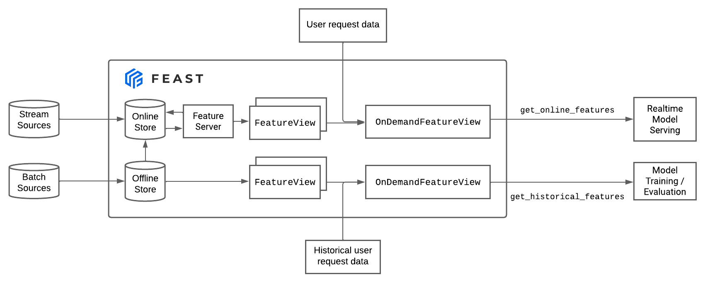
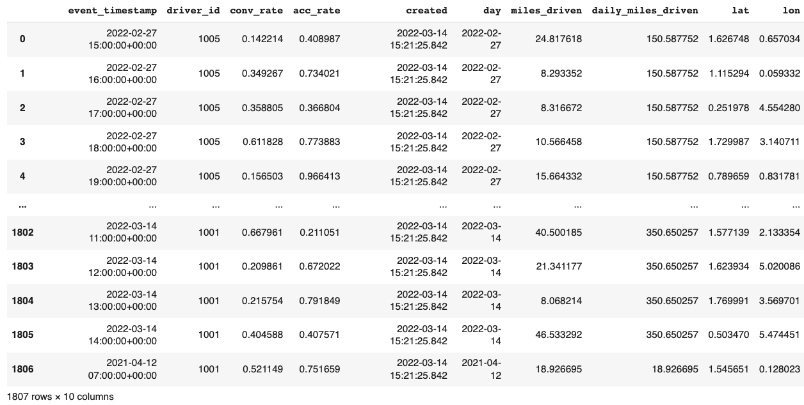
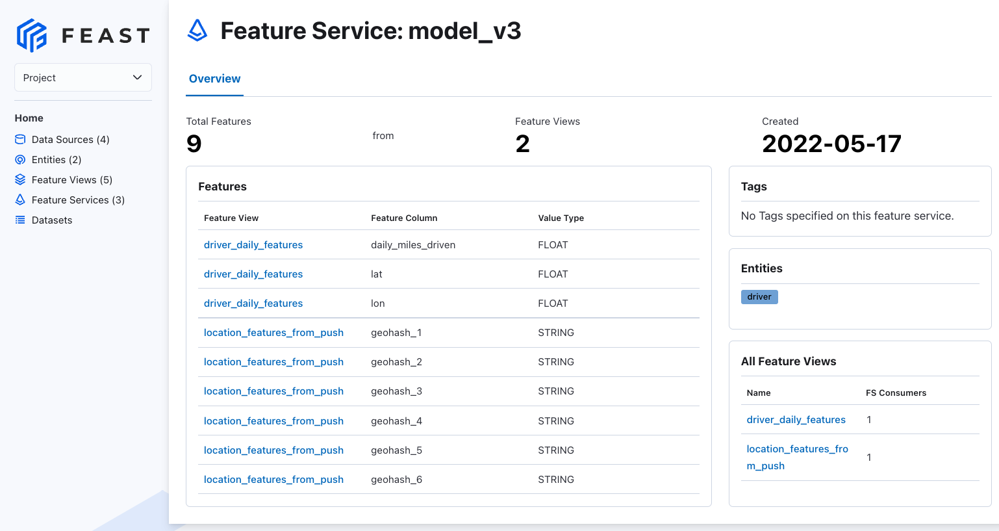
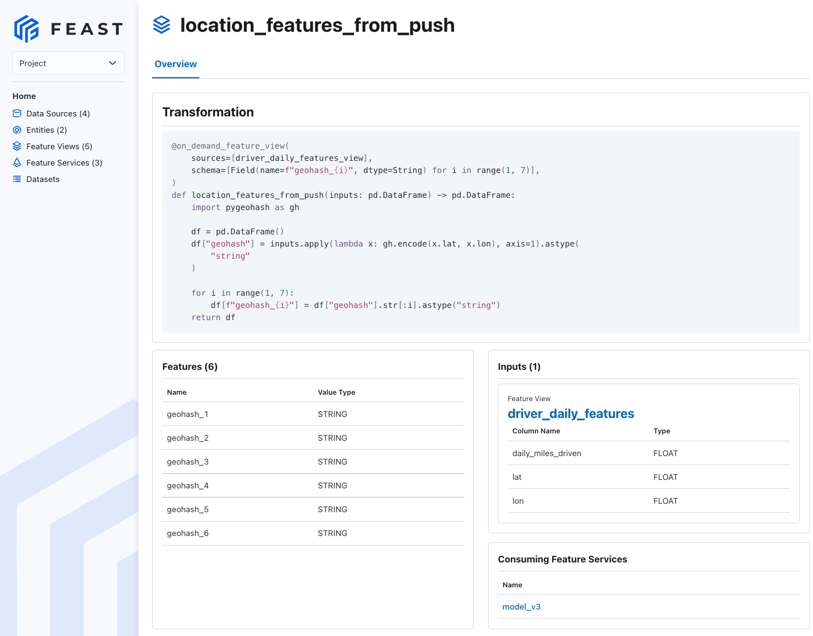

<h1>Module 2: On demand transformations</h1>

In this module, we introduce the concept of on demand transforms. These are transformations that execute on-the-fly and accept as input other feature views or request data.

On a high level, the flow of data will look like



<h2>Table of Contents</h2>

- [Workshop](#workshop)
  - [Step 1: Install Feast](#step-1-install-feast)
  - [Step 2: Look at the data we have](#step-2-look-at-the-data-we-have)
  - [Step 3: Understanding on demand feature views](#step-3-understanding-on-demand-feature-views)
  - [Step 4: Apply features](#step-4-apply-features)
  - [Step 5: Materialize batch features](#step-5-materialize-batch-features)
  - [Step 6 (optional): Explore the repository in the Web UI](#step-6-optional-explore-the-repository-in-the-web-ui)
  - [Step 7: Test retrieve features](#step-7-test-retrieve-features)
    - [Importing a library in the transformation](#importing-a-library-in-the-transformation)
- [Conclusion](#conclusion)
  
# Workshop
## Step 1: Install Feast

First, we install Feast as well as a Geohash module we want to use:
```bash
pip install feast
pip install pygeohash
```

## Step 2: Look at the data we have
We used `data/gen_lat_lon.py` to append randomly generated latitude and longitudes to the original driver stats dataset.

```python
import pandas as pd
pd.read_parquet("data/driver_stats_lat_lon.parquet")
```



## Step 3: Understanding on demand feature views
Let's look at an example on demand feature view in this repo

```python
@on_demand_feature_view(
    sources=[driver_hourly_stats_view, val_to_add_request],
    schema=[
        Field(name="conv_rate_plus_val1", dtype=Float64),
        Field(name="conv_rate_plus_val2", dtype=Float64),
    ],
)
def transformed_conv_rate(inputs: pd.DataFrame) -> pd.DataFrame:
    df = pd.DataFrame()
    df["conv_rate_plus_val1"] = inputs["conv_rate"] + inputs["val_to_add"]
    df["conv_rate_plus_val2"] = inputs["conv_rate"] + inputs["val_to_add_2"]
    return df
```

This is obviously not a particularly useful transformation, but is helpful for explaining on demand transforms and request data.
- **Request data** is any data available only from the request (at serving time). -
  - An example of this may be the amount of a credit card transaction that may be fraudulent. In the above example, there are `val_to_add` and `val_to_add_2` values passed in at request time.
- An **on demand feature view**:
  - can take as input sources other feature views or request data. 
  - applies a transformation on top of those sources (batch, streaming, or request).
    - Because a source feature view can have a `PushSource`, this means we can also apply a consistent last-mile transformation on both batch and streaming features.
  - Note that the above has a single `inputs` Pandas dataframe as input. This joins together all the sources for the `OnDemandFeatureView`


## Step 4: Apply features
```console
$ feast apply

Created entity driver
Created feature view driver_daily_features
Created feature view driver_hourly_stats
Created on demand feature view transformed_conv_rate
Created on demand feature view avg_hourly_miles_driven
Created on demand feature view location_features_from_push
Created feature service model_v3
Created feature service model_v2
Created feature service model_v1

Created sqlite table feast_demo_odfv_driver_daily_features
Created sqlite table feast_demo_odfv_driver_hourly_stats
```

## Step 5: Materialize batch features
```console
$ feast materialize-incremental $(date +%Y-%m-%d)

Materializing 2 feature views to 2022-05-17 12:41:18-04:00 into the sqlite online store.

driver_hourly_stats from 1748-08-01 16:41:20-04:56:02 to 2022-05-17 12:41:18-04:00:
100%|████████████████████████████████████████████████████████████████| 5/5 [00:00<00:00, 495.03it/s]
driver_daily_features from 1748-08-01 16:41:20-04:56:02 to 2022-05-17 12:41:18-04:00:
100%|███████████████████████████████████████████████████████████████| 5/5 [00:00<00:00, 1274.48it/s]
```

## Step 6 (optional): Explore the repository in the Web UI
You can see explore how different Feast objects relate to each other in the UI.
```bash
feast ui
```

For example, you can see the `model_v3` feature service and its resulting features..


... as well as what the underlying on demand transformation looks like


## Step 7: Test retrieve features 
Now we'll see how these transformations are executed offline at `get_historical_features` and online at `get_online_features` time. We'll also see how `OnDemandFeatureView` interacts with request data, regular feature views, and streaming / push features.

Try out the Jupyter notebook in [client/module_2_client.ipynb](client/module_2_client.ipynb). This is in a separate directory that contains just a `feature_store.yaml`.

### Importing a library in the transformation
If you use a library that's imported, the client will need to have this library imported. This is the case here (we rely on `pygeohash`):

```python
@on_demand_feature_view(
    sources=[driver_daily_features_view],
    schema=[Field(name=f"geohash_{i}", dtype=String) for i in range(1, 7)],
)
def location_features_from_push(inputs: pd.DataFrame) -> pd.DataFrame:
    import pygeohash as gh

    df = pd.DataFrame()
    df["geohash"] = inputs.apply(lambda x: gh.encode(x.lat, x.lon), axis=1).astype(
        "string"
    )

    for i in range(1, 7):
        df[f"geohash_{i}"] = df["geohash"].str[:i].astype("string")
    return df
```

This is an incentive to use a feature server.
- If you're using a feature server, you can include in your `Dockerfile` a pip install of this library. Then data scientists don't need to have this installed locally.

# Conclusion
By the end of this module, you will have learned how to leverage demand feature views to enable data scientists to author consistent transformations that will be applied at serving time. 

On demand feature views also enable combining request data with other pre-computed features to build essential real-time features.