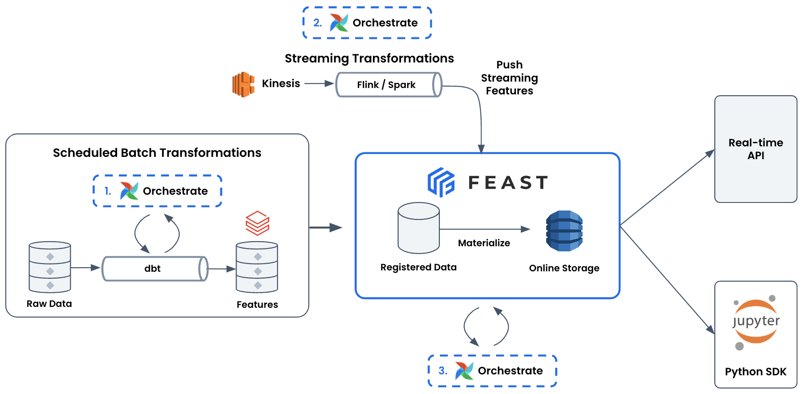
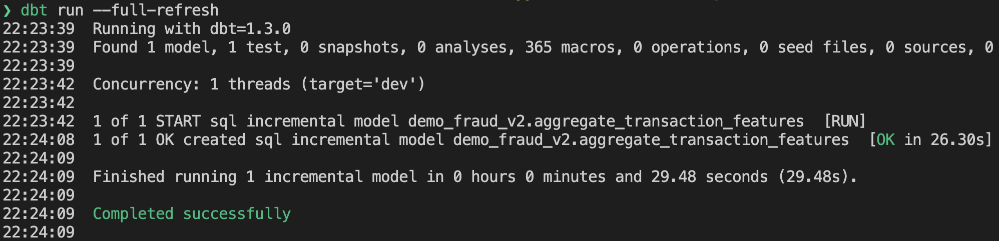
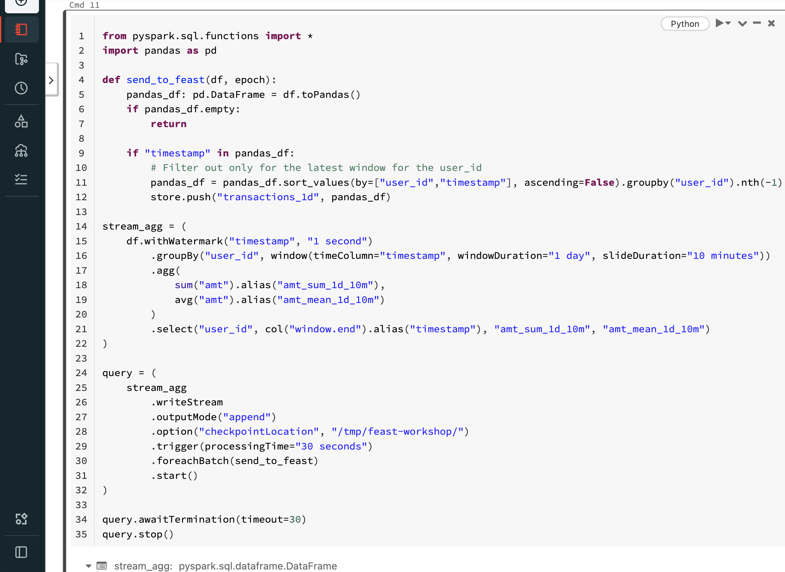
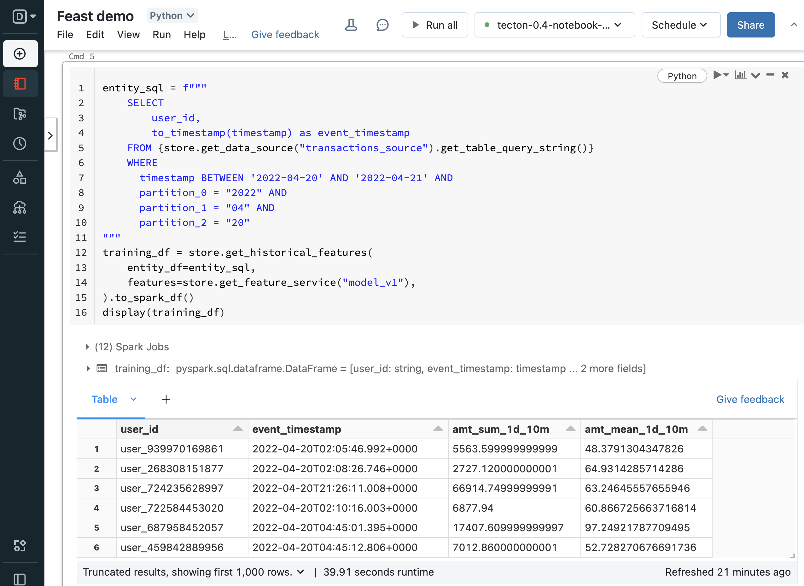
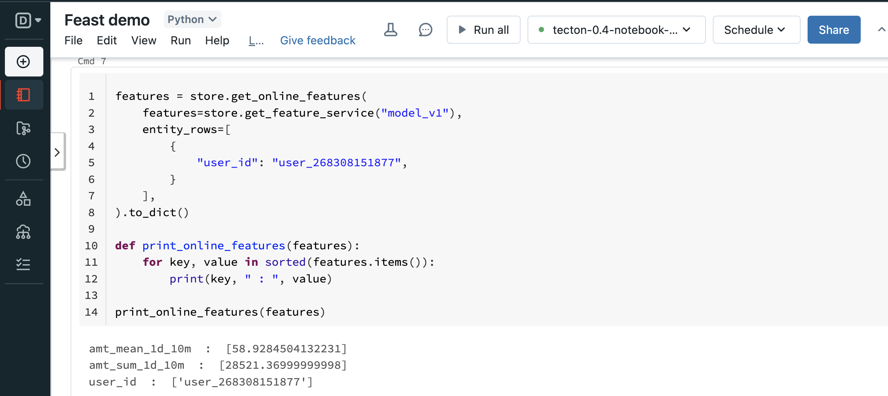

<h1>Module 3: Orchestrated batch / stream transformations using dbt + Airflow with Feast (Databricks)</h1>

> **Note:** This module is still WIP, and does not have a public data set to use. There is a smaller dataset visible in `data/`

This is a very similar module to module 1. The key difference is now we'll be using Databricks in combination with dbt + Airflow to ensure that batch features are regularly generated. 

**Caveats**
- Feast does not itself handle orchestration of data pipelines (transforming features, materialization) and relies on the user to configure this with tools like dbt and Airflow.
- Feast does not ensure consistency in transformation logic between batch and stream features

**Architecture**
- **Data sources**: Hive + Kinesis
- **Compute**: Databricks
- **Online store**: DynamoDB
- **Orchestrator**: Airflow + dbt
- **Use case**: Fraud detection



<h2>Table of Contents</h2>

- [Workshop](#workshop)
  - [Step 1: Setup](#step-1-setup)
    - [Step 1a: Install Feast](#step-1a-install-feast)
    - [Step 1b: Spin up Postgres database and Databricks](#step-1b-spin-up-postgres-database-and-databricks)
    - [Step 1c: Set up dbt models for batch transformations](#step-1c-set-up-dbt-models-for-batch-transformations)
  - [Step 2: Configure Feast](#step-2-configure-feast)
    - [Step 2a: Inspect the `feature_repo` directory for the feature definitions.](#step-2a-inspect-the-feature_repo-directory-for-the-feature-definitions)
    - [Step 2b: Inspect the `feature_store.yaml`](#step-2b-inspect-the-feature_storeyaml)
  - [Step 3: Run `feast apply`](#step-3-run-feast-apply)
  - [Step 4: Ingest features](#step-4-ingest-features)
    - [Step 4a: Streaming features](#step-4a-streaming-features)
    - [Step 4b: Backfilling batch features on a schedule (dbt + Airflow)](#step-4b-backfilling-batch-features-on-a-schedule-dbt--airflow)
      - [Examine the Airflow DAG](#examine-the-airflow-dag)
      - [Setup Airflow to talk to dbt](#setup-airflow-to-talk-to-dbt)
      - [Enable the Airflow DAG and see the UI](#enable-the-airflow-dag-and-see-the-ui)
      - [Q: What if different feature views have different freshness requirements?](#q-what-if-different-feature-views-have-different-freshness-requirements)
      - [(optional): Run a backfill](#optional-run-a-backfill)
  - [Step 5: Retrieve features](#step-5-retrieve-features)
    - [Overview](#overview)
    - [Time to run code!](#time-to-run-code)
      - [Demo: Generating training data](#demo-generating-training-data)
      - [Demo: Fetching online features to predict fraud](#demo-fetching-online-features-to-predict-fraud)
  - [Step 6: Options for orchestrating streaming pipelines](#step-6-options-for-orchestrating-streaming-pipelines)
- [Conclusion](#conclusion)
  - [Limitations](#limitations)
  - [Why Feast?](#why-feast)
- [FAQ](#faq)
    - [How do I iterate on features?](#how-do-i-iterate-on-features)
    - [How does this work in production?](#how-does-this-work-in-production)

# Workshop
## Step 1: Setup
### Step 1a: Install Feast

First, we install Feast with Spark, Postgres, and DynamoDB support:
```bash
pip install "feast[spark,postgres,aws]"
```

###  Step 1b: Spin up Postgres database and Databricks
You'll need to spin up a PostgreSQL instance (e.g. AWS RDS) for the registry, and then replace the path in the above `feature_store.yaml`.

You'll also need `databricks-connect` installed and configured so Feast can talk to Databricks.

### Step 1c: Set up dbt models for batch transformations
> **TODO(adchia):** Generate parquet file to upload for public dataset for features
 
There's already a dbt model in this repository that transforms batch data. You just need to change the [S3 staging location](module_3_db/dbt/feast_demo/dbt_project.yml) and instantiate it:

> **Note:** You'll need to install dbt-databricks as well! `pip install dbt-databricks`

To initialize dbt with your own credentials, do this
```bash
# After updating the dbt_project.yml with your S3 location
cd dbt/feast_demo; dbt init; dbt run
```

This will create the initial tables we need for Feast:


## Step 2: Configure Feast
### Step 2a: Inspect the `feature_repo` directory for the feature definitions.
This includes the data sources, feature schemas (feature views), and model versions (feature services).

### Step 2b: Inspect the `feature_store.yaml`
This configures how Feast communicates with services you manage to make features available for training / serving.

```yaml
project: feast_demo
provider: aws
registry:
  registry_type: sql
  path: postgresql://postgres:mysecretpassword@[your-rds-instance]:5432/feast
online_store:
  type: dynamodb
  region: us-west-1
offline_store:
  type: spark
  spark_conf: # Note: pip install -U "databricks-connect"
      spark.ui.enabled: "false"
      spark.eventLog.enabled: "false"
      spark.sql.catalogImplementation: "hive"
      spark.sql.parser.quotedRegexColumnNames: "true"
      spark.sql.session.timeZone: "UTC"
entity_key_serialization_version: 2
```
## Step 3: Run `feast apply`
In this example, we're using a test data source registered in Hive Metastore / AWS Glue Catalog (backed by an S3 bucket). 

To get started, go ahead and register the feature repository
```console
$ cd feature_repo; feast apply

Created entity user
Created feature view user_transaction_amount_metrics
Created feature service model_v1

Deploying infrastructure for user_transaction_amount_metrics
```

## Step 4: Ingest features
As seen in below, to compute a daily transaction aggregate feature, we need to:
1. Generate streaming features
   - (outside of Feast): Connect to stream, transform features
   - (Feast): Push above feature values into Feast
2. Backfill feature values from historical stream logs
   - (outside of Feast with dbt + Airflow): Transform raw data into batch features
   - (Feast + Airflow): Backfill (materialize) feature values into the online store.


### Step 4a: Streaming features
To achieve fresher features, one might consider using streaming compute.There are two broad approaches with streaming
1. **[Simple, semi-fresh features]** Use data warehouse / data lake specific streaming ingest of raw data.
   - This means that Feast only needs to know about a "batch feature" because the assumption is those batch features are sufficiently fresh.
   - **BUT** there are limits to how fresh your features are. You won't be able to get to minute level freshness.
2. **[Complex, very fresh features]** Build separate streaming pipelines for very fresh features
   - It is on you to build out a separate streaming pipeline (e.g. using Spark Structured Streaming or Flink), ensuring the transformation logic is consistent with batch transformations, and calling the push API as per [module 1](../module_1/README.md). 

Feast will help enforce a consistent schema across batch + streaming features as they land in the online store. 

See the sample notebook you can import into Databricks [here](sample_db_notebook.ipynb) to see how you ingest from a stream, transform it, and finally push the transformed features into Feast.



> **Note:** Not shown here is the need to orchestrate + monitor this job (for each feature view) and ensure it continues to land in Feast. You'll have to set that up outside Feast.

### Step 4b: Backfilling batch features on a schedule (dbt + Airflow)
- You'll want to first run a backfill job (to populate the online store from all historical data). 
- Then, you want to orchestrate more daily jobs that loads new incoming batch features into the online store.

#### Examine the Airflow DAG
The example dag is going to run on a daily basis and materialize *all* feature views based on the start and end interval. Note that there is a 1 hr overlap in the start time to account for potential late arriving data in the offline store. 

With dbt incremental models, the model itself in incremental mode selects overlapping windows of data to account for late arriving data. Feast materialization similarly has a late arriving threshold.

```python
with DAG(
    dag_id="feature_dag",
    start_date=pendulum.datetime(2021, 1, 1, tz="UTC"),
    description="A dbt + Feast DAG",
    schedule="@daily",
    catchup=False,
    tags=["feast"],
) as dag:
    dbt_test = BashOperator(
        task_id="dbt_test",
        bash_command="""
            cd ${AIRFLOW_HOME}; dbt test --models "aggregate_transaction_features"
            """,
        dag=dag,
    )

    # Generate new transformed feature values
    dbt_run = BashOperator(
        task_id="dbt_run",
        bash_command="""
            cd ${AIRFLOW_HOME}; dbt run --models "aggregate_transaction_features"
            """,
        dag=dag,
    )

    # Use Feast to make these feature values available in a low latency store
    @task()
    def materialize(data_interval_start=None, data_interval_end=None):
        repo_config = RepoConfig(
            registry=RegistryConfig(
                registry_type="sql",
                path="postgresql://postgres:mysecretpassword@[YOUR-RDS-ENDPOINT:PORT]/feast",
            ),
            project="feast_demo",
            provider="local",
            offline_store=SparkOfflineStoreConfig(
                spark_conf={
                    "spark.ui.enabled": "false",
                    "spark.eventLog.enabled": "false",
                    "spark.sql.catalogImplementation": "hive",
                    "spark.sql.parser.quotedRegexColumnNames": "true",
                    "spark.sql.session.timeZone": "UTC",
                }
            ),
            online_store=DynamoDBOnlineStoreConfig(region="us-west-1"),
            entity_key_serialization_version=2,
        )
        store = FeatureStore(config=repo_config)
        # Add 1 hr overlap to account for late data
        # Note: normally, you'll probably have different feature views with different freshness requirements, instead
        # of materializing all feature views every day.
        store.materialize(data_interval_start.subtract(hours=1), data_interval_end)

    # Setup DAG
    dbt_test >> dbt_run >> materialize()
```
#### Setup Airflow to talk to dbt
We setup a standalone version of Airflow to set up the `PythonOperator` (Airflow now prefers @task for this) and `BashOperator` which will run incremental dbt models. We use dbt to transform raw data on Databricks, and once the incremental model is tested / ran, we run materialization.

The below script will copy the dbt DAGs over. In production, you'd want to use Airflow to sync with version controlled dbt DAGS (e.g. that are sync'd to S3).

```bash
# FIRST: Update the DAG to reference your RDS registry
# SECOND: Update setup_airflow.sh to use your Databricks credentials
cd ../airflow_demo; sh setup_airflow.sh
```

#### Enable the Airflow DAG and see the UI
Now go to `localhost:8080`, use Airflow's auto-generated admin password to login, and toggle on the DAG. It should run one task automatically. After waiting for a run to finish, you'll see a successful job:


#### Q: What if different feature views have different freshness requirements?

There's no built in mechanism for this, but you could store this logic in the feature view tags (e.g. a `batch_schedule`).
 
Then, you can parse these feature view in your Airflow job. You could for example have one DAG that runs all the daily `batch_schedule` feature views, and another DAG that runs all feature views with an hourly `batch_schedule`.

#### (optional): Run a backfill
To run a backfill (i.e. process previous days of the above while letting Airflow manage state), you can do (from the `airflow_demo` directory):

> **Warning:** This works correctly with the Redis online store because it conditionally writes. This logic has not been implemented for other online stores yet, and so can result in incorrect behavior

```bash
export AIRFLOW_HOME=$(pwd)/airflow_home
airflow dags backfill \
    --start-date 2021-07-01 \
    --end-date 2021-07-15 \
    feature_dag
```

## Step 5: Retrieve features
### Overview
Feast exposes a `get_historical_features` method to generate training data / run batch scoring and `get_online_features` method to power model serving.

### Time to run code!
See the sample notebook you can import into Databricks [here](sample_db_notebook.ipynb)

#### Demo: Generating training data


#### Demo: Fetching online features to predict fraud


## Step 6: Options for orchestrating streaming pipelines
We don't showcase how this works, but broadly there are many approaches to this. In all the approaches, you'll likely want to generate operational metrics for monitoring (e.g. via StatsD or Prometheus Pushgateway).

To outline a few approaches:
  - **Option 1**: frequently run stream ingestion on a trigger, and then run this in the orchestration tool of choice like Airflow, Databricks Jobs, etc. e.g. 
    ```python
    (stream_agg
        .writeStream
        .outputMode("append") 
        .option("checkpointLocation", "/tmp/feast-workshop/q3/")
        .trigger(once=True)
        .foreachBatch(send_to_feast)
        .start())
    ```
  - **Option 2**: with Databricks, use Databricks Jobs to monitor streaming queries and auto-retry on a new cluster + on failure. See [Databricks docs](https://docs.databricks.com/structured-streaming/query-recovery.html#configure-structured-streaming-jobs-to-restart-streaming-queries-on-failure) for details.
  - **Option 3**: with Dataproc, configure [restartable jobs](https://cloud.google.com/dataproc/docs/concepts/jobs/restartable-jobs)
  - **Option 4** If you're using Flink, then consider configuring a [restart strategy](https://nightlies.apache.org/flink/flink-docs-release-1.15/docs/ops/state/task_failure_recovery/)

# Conclusion
By the end of this module, you will have learned how to build a full feature platform, with orchestrated batch transformations (using dbt + Airflow), orchestrated materialization (with Feast + Airflow), and pointers on orchestrating streaming transformations.

## Limitations
- Feast does not itself handle orchestration of transformation or materialization, and relies on the user to configure this with tools like dbt and Airflow. 
- Feast does not ensure consistency in transformation logic between batch and stream features

## Why Feast?
Feast abstracts away the need to think about data modeling in the online store and helps you:
- maintain fresh features in the online store by
  - ingesting batch features into the online store (via `feast materialize` or `feast materialize-incremental`)
  - ingesting streaming features into the online store (e.g. through `feature_store.push` or a Push server endpoint (`/push`))
- serve features (e.g. through `feature_store.get_online_features` or through feature servers)

# FAQ

### How do I iterate on features?
Once a feature view is in production, best practice is to create a new feature view (+ a separate dbt model) to generate new features or change existing features, so-as not to negatively impact prediction quality.

This means for each new set of features, you'll need to:
1. Define a new dbt model
2. Define a new Feast data source + feature view, and feature service (model version) that depends on these features.
3. Ensure the transformations + materialization jobs are executed at the right cadence with Airflow + dbt + Feast.

### How does this work in production?
Several things change:
- All credentials are secured as secrets
- dbt models are version controlled
- Production deployment of Airflow (e.g. syncing with a Git repository of DAGs, using k8s)
- Bundling dbt models with Airflow (e.g. via S3 like this [MWAA + dbt guide](https://docs.aws.amazon.com/mwaa/latest/userguide/samples-dbt.html))
- Airflow DAG parallelizes across feature views (instead of running a single `feature_store.materialize` across all feature views)
- Feast materialization is configured to be more scalable (e.g. using other Feast batch materialization engines [Bytewax](https://docs.feast.dev/reference/batch-materialization/bytewax), [Snowflake](https://docs.feast.dev/reference/batch-materialization/snowflake), [Lambda](https://docs.feast.dev/reference/batch-materialization/lambda), [Spark](https://docs.feast.dev/reference/batch-materialization/spark))