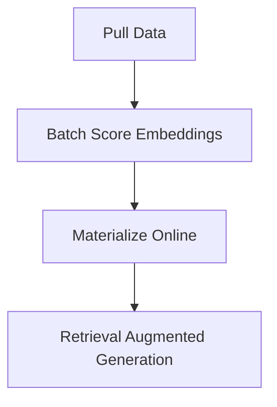

This is a demo to show how you can use Feast to do RAG

## Installation via PyEnv and Poetry

This demo assumes you have Pyenv (2.3.10) and Poetry (1.4.1) installed on your machine as well as Python 3.9.

```bash
pyenv local 3.9
poetry shell
poetry install
```
## Setting up the data and Feast

To fetch the data simply run
```bash
python pull_states.py
```
Which will output a file called `city_wikipedia_summaries.csv`.

Then run
```bash
python batch_score_documents.py
```
Which will output data to `data/city_wikipedia_summaries_with_embeddings.parquet`

Next we'll need to do some Feast work and move the data into a repo created by
Feast.

## Feast

To get started, make sure to have Feast installed and PostGreSQL.

First run
```bash
cp ./data feature_repo/
```

And then open the `module_4.ipynb` notebook and follow those instructions.

It will walk you through a trivial tutorial to retrieve the top `k` most similar
documents using PGVector.

# Overview

The overview is relatively simple, the goal is to define an architecture
to support the following:



# Results

The simple demo shows the code below with the retrieved data shown.

```python
import pandas as pd

from feast import FeatureStore
from batch_score_documents import run_model, TOKENIZER, MODEL
from transformers import AutoTokenizer, AutoModel

df = pd.read_parquet("./feature_repo/data/city_wikipedia_summaries_with_embeddings.parquet")

store = FeatureStore(repo_path=".")

# Prepare a query vector
question = "the most populous city in the U.S. state of Texas?"

tokenizer = AutoTokenizer.from_pretrained(TOKENIZER)
model = AutoModel.from_pretrained(MODEL)
query_embedding = run_model(question, tokenizer, model)
query = query_embedding.detach().cpu().numpy().tolist()[0]

# Retrieve top k documents
features = store.retrieve_online_documents(
    feature="city_embeddings:Embeddings",
    query=query,
    top_k=3
)
```
And running `features_df.head()` will show:

```
features_df.head()
        Embeddings	                                        distance
0	[0.11749928444623947, -0.04684492573142052, 0....	0.935567
1	[0.10329511761665344, -0.07897591590881348, 0....	0.939936
2	[0.11634305864572525, -0.10321836173534393, -0...	0.983343
```
