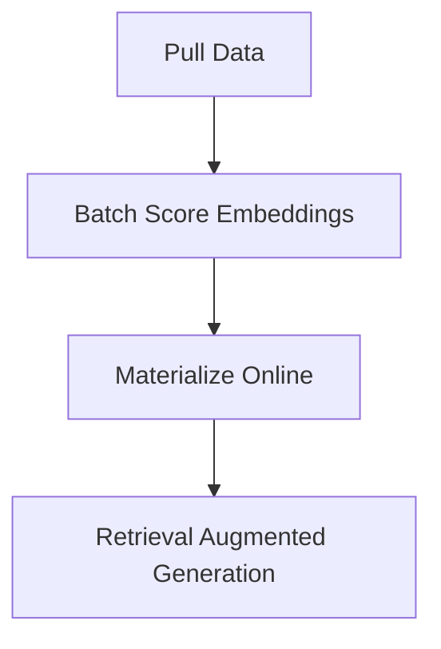

This is a demo to show how you can use Feast to do RAG

## Installation via PyEnv and Poetry

This demo assumes you have Pyenv (2.3.10) and Poetry (1.4.1) installed on your machine as well as Python 3.9.

```bash
pyenv local 3.9
poetry shell
poetry install
```
## Setting up the data and Feast

To fetch the data simply run
```bash
python pull_states.py
```
Which will output a file called `city_wikipedia_summaries.csv`.

Then run
```bash
python batch_score_documents.py
```
Which will output data to `data/city_wikipedia_summaries_with_embeddings.parquet`

Next we'll need to do some Feast work and move the data into a repo created by
Feast.

## Feast

To get started, make sure to have Feast installed and PostGreSQL.

First run
```bash
cp ./data feature_repo/
```

And then open the `module_4.ipynb` notebook and follow those instructions.

It will walk you through a trivial tutorial to retrieve the top `k` most similar
documents using PGVector.

# Overview

The overview is relatively simple, the goal is to define an architecture
to support the following:



